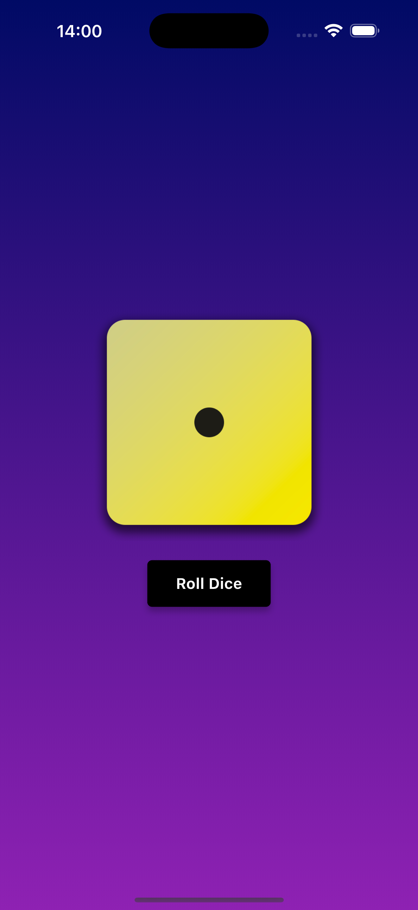
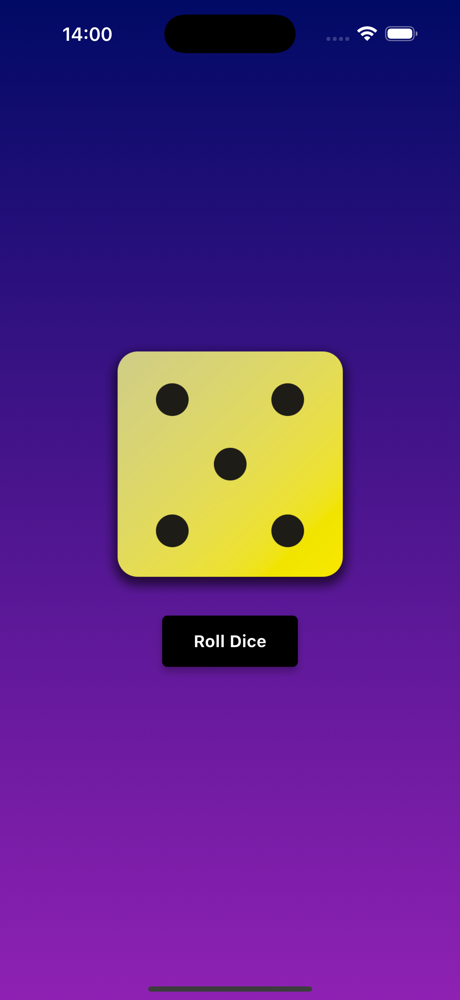
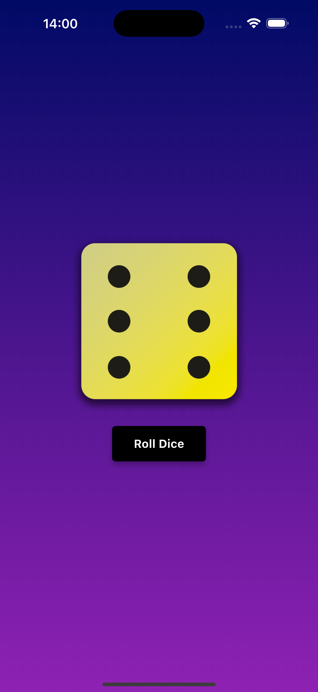

# 🎲 Dice Roller

A simple Flutter app that simulates a dice roll. Press the button to roll the dice and get a random number between 1 and 6.

## 🚀 Features

- Clean Flutter UI
- Random number generation
- Dice image updates on roll

## 📱 Screenshots






## 🛠️ Built With

- Flutter
- Dart

## 📦 Getting Started

```bash
git clone https://github.com/Aditya-602/DiceRoller.git
cd DiceRoller
flutter pub get
flutter run
